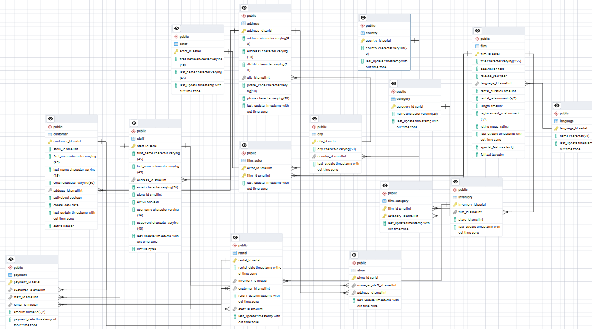
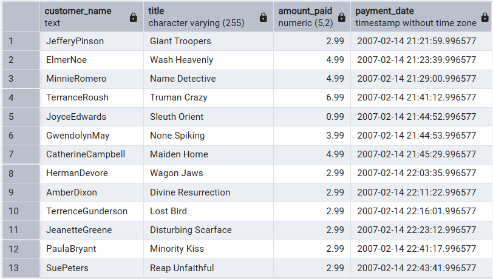
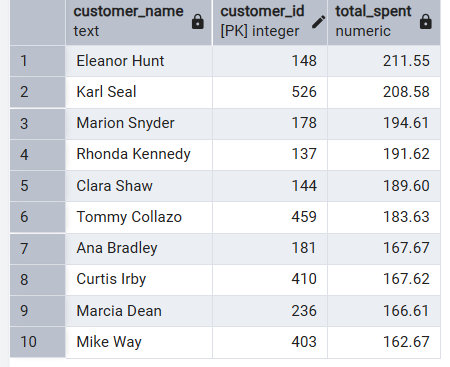
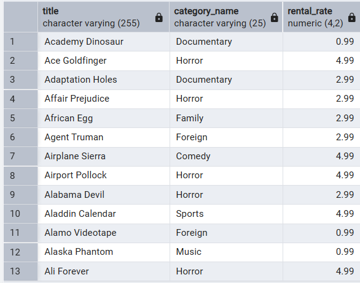
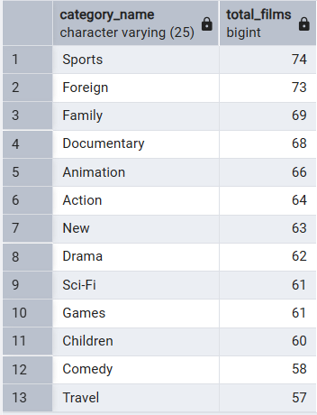
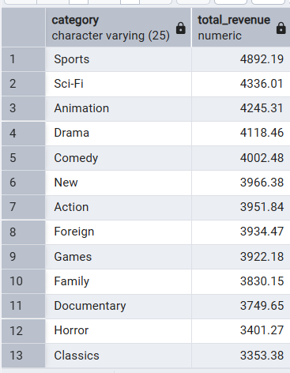
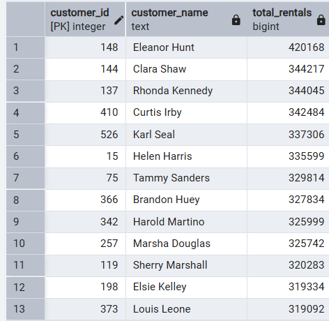
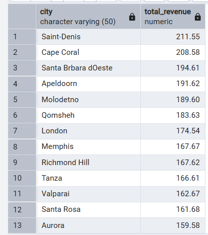

# Week 3 – SQL Joins & Relational Database Analysis
### DVD Rental Database (PostgreSQL)

This project explores the DVD Rental sample database using SQL JOINs to answer real
business questions, and documents the table relationships that make those joins possible.

---

## 1. Database Relationship Diagram (ER Diagram)

The DVD Rental database is normalized into 15 related tables. Key relationships:

- `country` → `city` → `address` (location hierarchy)
- `address` → `customer`, `staff`, `store`
- `customer` → `rental` → `payment`
- `staff` → `rental`, `payment`
- `film` → `inventory` → `rental`
- `film` ↔ `actor` (via `film_actor`)
- `film` ↔ `category` (via `film_category`)

**Primary Keys:** every table has a single-column surrogate key (e.g. `customer_id`,
`film_id`, `actor_id`, `payment_id`).

**Foreign Keys:** e.g. `customer.address_id → address.address_id`,
`rental.customer_id → customer.customer_id`,
`payment.rental_id → rental.rental_id`,
`film_actor.film_id → film.film_id` and `film_actor.actor_id → actor.actor_id`.

`film_actor` and `film_category` are junction (bridge) tables — they exist purely to
resolve the many-to-many relationships between `film`↔`actor` and `film`↔`category`,
since a film can have many actors and an actor can appear in many films (same logic
applies to categories).

---

## 2. JOINs Used — Explanation

| JOIN Type | Used In | Why |
|---|---|---|
| **INNER JOIN** | Q1, Q2/3, Q4, Q5, Q6, Q7, Q8, Q9, Q10, Bonus | Used throughout because every business question only cares about rows that have a match on both sides (e.g. a customer who has actually made a payment, a film that actually has a category). Rows without a match aren't relevant to the question, so INNER JOIN is the correct default. |
| **LEFT JOIN** | Demonstration query | Returns *all* customers regardless of whether they've made a payment, filling in `NULL` for customers with none. Used to show how you'd find customers with zero activity — something an INNER JOIN would hide. |
| **RIGHT JOIN** | Demonstration query | Mirror of LEFT JOIN — returns all rows from the right-hand table (`customer`) regardless of match on the left (`payment`). Functionally interchangeable with a LEFT JOIN if you just swap table order; included to show the syntax. |
| **FULL OUTER JOIN** | Demonstration query | Returns everything from both tables, matched where possible. Useful for data-integrity checks — e.g. spotting orphaned payments or customers who never transacted — rather than for a specific business question. |
| **SELF JOIN** | Demonstration query | Joins the `customer`/`address` tables to themselves to find customers who share the same city. Used when a relationship exists *within* a single table's data rather than between two different tables. |

---

## 3. How Each Business Question Was Solved

1. **Customer Name, Email, City, Country** — Chained `customer → address → city → country`
   through their foreign keys, since customer location isn't stored directly on the
   customer table (normalization).

2 & 3. **Payments with Customer Name, Film Title, Amount** — `payment` only stores
   `customer_id` and `rental_id`. Had to go `payment → rental → inventory → film` to
   reach the film title, and `payment → customer` for the name — five tables in one query.

4. **Top 10 customers by total spent** — Joined `customer` to `payment`, grouped by
   customer, summed `amount`, sorted descending, limited to 10.

5. **Film with Category and Rental Rate** — `film` and `category` have no direct
   foreign key; had to go through the junction table `film_category` to connect them.

6. **Actors in each film** — Same junction-table pattern: `film → film_actor → actor`,
   since a film-to-actor relationship is many-to-many.

7. **Count of films per category** — Joined `category → film_category` and counted
   rows per category (no need to reach `film` itself since `film_category` already
   holds `film_id`).

8. **Highest revenue by category** — The longest chain: `category → film_category →
   film → inventory → rental → payment`, summing `amount` grouped by category, since
   revenue lives in `payment` but category lives five tables away.

9. **Customers who rented more than 20 films** — Joined `customer → rental`, grouped
   by customer, counted rentals, filtered with `HAVING count > 20` (not `WHERE`,
   since the filter applies after aggregation).

10. **Cities with highest rental revenue** — Chained `city → address → customer →
    payment` to connect geography to money, since revenue and location live in
    completely separate tables.

**Bonus — Actor with highest total rental revenue:** There's no direct relationship
between `actor` and `payment`, so the shortest path was worked out by tracing
foreign keys table by table:
`actor → film_actor → film → inventory → rental → payment`
Five joins were needed to connect an actor to actual money paid.

---

## 4. Business Insights

- **Top customers drive disproportionate revenue.** The top 10 customers each spent
  between $162.67 and $211.55, with Eleanor Hunt (customer #148) as the single highest
  spender at $211.55. The gap between #1 and #10 is under $50, showing the top-spending
  segment is fairly tight-knit rather than dominated by one outlier — a loyalty or
  VIP program targeting this whole group (not just the #1 spender) would likely have
  strong ROI.

- **Sports is the clear leader in both popularity and revenue.** Sports tops both the
  film-count ranking (74 films) and the revenue ranking ($4,892.19) — the only category
  to lead in both metrics. This suggests Sports isn't just well-stocked, it's actually
  the most rented/watched genre, making it a safe category to keep expanding inventory in.

- **Revenue doesn't always follow catalog size.** Sci-Fi generates the second-highest
  revenue ($4,336.01) despite having only 61 films — fewer than Foreign (73), Family (69),
  Documentary (68), and Animation (66), all of which earn less. This means Sci-Fi titles
  are punching above their weight per film, making it a strong candidate for adding more
  titles to the catalog since demand seems to outpace current supply.

- **Revenue is geographically spread thin, not concentrated.** The top 10 cities by
  revenue almost exactly mirror the top 10 individual customers by spend (Saint-Denis
  matches Eleanor Hunt's $211.55, Cape Coral matches Karl Seal's $208.58, and so on).
  This indicates each of these "top cities" is really just one high-spending customer
  rather than a genuinely strong regional market — so city-level totals here reflect
  individual behavior more than true geographic demand.

---

## 5. Screenshots

### ER Diagram

### Query Results

| Query | Screenshot |
|---|---|
| Q1 – Customer Name, Email, City, Country |  |
| Q2 & Q3 – Payments with Customer & Film |  |
| Q4 – Top 10 Customers by Spend |  |
| Q5 – Film, Category, Rental Rate |  |
| Q6 – Actors per Film |  |
| Q7 – Film Count per Category |  |
| Q8 – Revenue per Category |  |
| Q9 – Customers with 20+ Rentals |  |
| Q10 – Revenue per City |  |
| Bonus – Top Revenue-Generating Actor |  |

