# DVD Rental Database: Aggregation, Subqueries, CTEs & Window Functions

This project answers a set of business questions using the Pagila/dvdrental sample database. It covers aggregation basics, subquery patterns, and CTE plus window function techniques, finishing with a bonus challenge that combines all three.

---

## When to Use a Subquery vs a CTE vs a Window Function

These three tools often solve overlapping problems, so it helps to know when each one actually makes sense.

**Subquery**

A subquery is a query nested inside another query. Use it when you need a single value or a small filtered list to plug into a bigger query, and you're only going to use that result once. Good use cases are comparing a row against an aggregate (like "salary greater than the average salary"), or checking existence with `EXISTS`/`NOT EXISTS`. Subqueries get messy fast if you nest more than two levels deep or need to reuse the same logic multiple times in one query.

**CTE (Common Table Expression)**

A CTE is a subquery with a name attached, defined using `WITH`. Use it when the logic has multiple steps, when you want to reuse the same intermediate result more than once in the same query, or when the query would otherwise turn into a wall of nested parentheses that's hard to read. CTEs don't do anything a subquery can't technically do, they just make multi-step logic readable and easier to debug, since you can run each CTE block on its own to check it works before chaining the next one.

**Window Function**

A window function calculates something across a set of related rows (a "window") without collapsing those rows into one, the way `GROUP BY` does. Use it when you need row-level detail alongside a group-level calculation at the same time, like ranking each customer within their city while still showing every customer's row, or comparing an employee's salary to their department average without losing the individual row. If the question involves words like "top N per group," "rank," or "running total," that's almost always a window function.

**Quick way to decide:**
- Need one value to compare against? Subquery.
- Need multiple steps or reused logic? CTE.
- Need to rank, compare to a group average, or get a running total while keeping every row visible? Window function.
- Most real business questions end up combining all three, which is exactly what the bonus challenge does.

---

## How Each Business Question Was Solved

### Part 1: Aggregation Basics

**Q1: Total revenue per store**
Joined `payment` to `rental` to `inventory` to get each payment tied back to the store that owned the rented copy, then summed `amount` grouped by `store_id`.

**Q2: Average rental duration per film category**
Calculated the actual number of days each rental lasted by subtracting `rental_date` from `return_date`, converted that interval into a plain number using `EXTRACT(EPOCH...)/86400`, then averaged it per category after joining through `film_category` and `category`.

**Q3: Rentals per month**
Grouped rentals by `DATE_TRUNC('month', rental_date)` and counted rows in each group.

**Q4: Categories with more than 50 films**
Grouped films by category and counted them, then used `HAVING COUNT(...) > 50` to filter the groups after aggregation, since `WHERE` can't filter on an aggregate result.

### Part 2: Subquery Challenges

**Q5: Customers who spent more than average**
First calculated each customer's total spend in an inner subquery, then compared that against the overall average of all those totals using a second subquery, so the comparison is average-of-totals, not average-of-individual-payments.

**Q6: Highest rental rate film per category**
Used a correlated subquery: for every film, it checks whether that film's rental rate equals the max rental rate of films in that same category. The subquery re-runs once per outer row because it references the outer query's category each time.

**Q7: Customers who never rented**
Used `NOT EXISTS` to check, for every customer, whether zero matching rows exist in the rental table. Also showed the `NOT IN` version, but `NOT EXISTS` is safer since `NOT IN` can behave unexpectedly if the subquery ever returns a NULL.

**Q8: Store with highest total revenue**
Calculated total revenue per store in a subquery inside `FROM`, then filtered in the outer `WHERE` clause by comparing each store's revenue to the max revenue found across all stores using another subquery.

### Part 3: CTE & Window Function Challenges

**Q9: Rank customers by spend within city**
Built a CTE that computes each customer's total spend and their city, then applied `RANK() OVER (PARTITION BY city ORDER BY total_spent DESC)` so ranking restarts for every city instead of running across the whole table.

**Q10: Most recently rented film per customer**
Used a CTE with `ROW_NUMBER() OVER (PARTITION BY customer_id ORDER BY rental_date DESC)` to number each customer's rentals from most recent to oldest, then filtered to keep only row number 1.

**Q11: Month-over-month revenue growth**
First CTE totals revenue per month. Second CTE uses `LAG()` to pull in the previous month's revenue next to the current month. The final `SELECT` calculates percentage growth between the two.

**Q12: Top 3 highest grossing films per category**
First CTE calculates total revenue per film. Second CTE ranks films within each category using `RANK() OVER (PARTITION BY category ORDER BY total_revenue DESC)`. Final query keeps only rank 1 through 3.

### Bonus: Top staff member per store and their revenue share

Three chained CTEs. First calculates total revenue per staff member. Second sums that up to get total revenue per store. Third ranks staff within each store by revenue using `RANK()`. The final `SELECT` keeps only the top ranked staff member per store and divides their revenue by the store total to get a percentage.

---

## Business Insights

1. **Revenue is almost perfectly split between the two stores.** Store 1 brought in $30,628.91 and Store 2 brought in $30,683.13, a difference of only about $54, less than 0.2% apart. This means neither location is outperforming the other in any meaningful way, so decisions like staffing levels or marketing budget probably shouldn't favor one store over the other based on revenue alone. If anything, this evenness suggests both stores are being fed a similar customer base and inventory mix, and any future underperformance from one store would actually be a signal worth investigating rather than normal variation.

2. **Top grossing films are unevenly spread across categories, some genres have a clear standout while others are flat.** Comedy's top film (Zorro Ark) pulled in $199.72 and Documentary's top film (Wife Turn) pulled in $198.73, both well above Classics' top film, which only reached $136.78. This tells us Comedy and Documentary have at least one title acting as a strong revenue driver, while Classics doesn't have a single film carrying the category the same way. Categories like this are worth digging into further: is Classics underperforming because of fewer copies in inventory, less popular titles, or genuinely lower demand? Whatever the reason, it's a candidate for either restocking with more popular titles or deprioritizing shelf space.

3. **Customer spend is fairly spread out, not concentrated in a tiny group.** 285 out of roughly 599 total customers, just under half, spent more than the average customer. The top spender (customer 148) spent $211.55, only around $57 more than the customer sitting near the bottom of this above-average list at $154.66. That's a pretty narrow range for a "top half," which suggests spend isn't dominated by a handful of whale customers, it's a broad, fairly even base of engaged renters. That's actually a healthier sign for the business than if revenue were concentrated in just a few accounts, since it means less risk if any single customer stops renting.

---

## Screenshots

All screenshots are stored in the `Query_outputs` folder.

### Part 1: Aggregation Basics

**Q1: Total revenue per store**
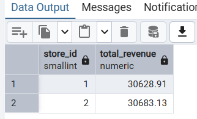

**Q2: Average rental duration per category**
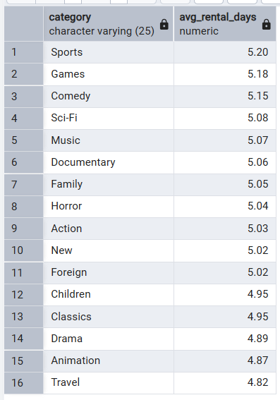

**Q3: Rentals per month**
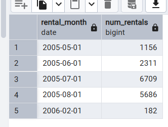

**Q4: Categories with more than 50 films**
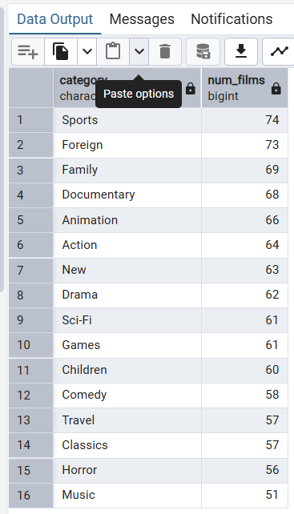

### Part 2: Subquery Challenges

**Q5: Customers who spent more than average**
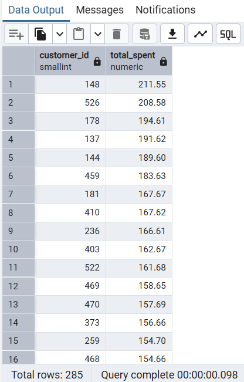

**Q6: Highest rental rate film per category**
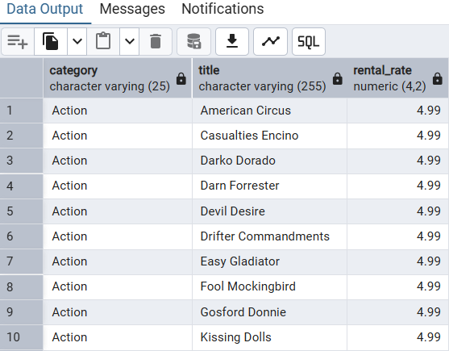

**Q7: Customers who never rented**
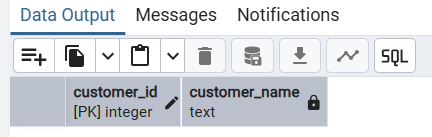

**Q8: Store with highest total revenue**
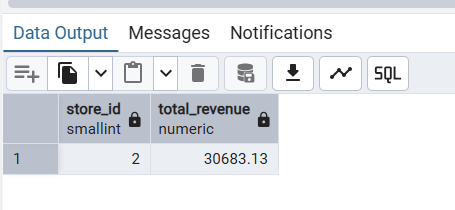

### Part 3: CTE & Window Function Challenges

**Q9: Rank customers by spend within city**
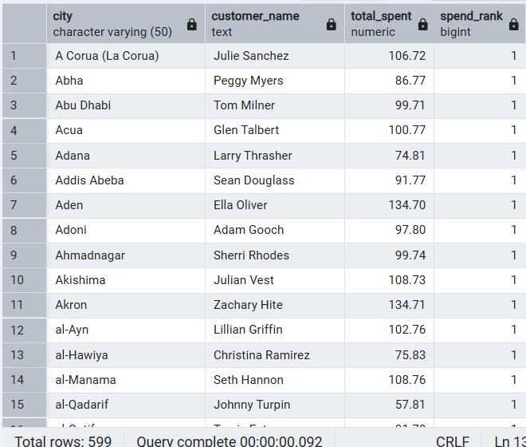

**Q10: Most recently rented film per customer**
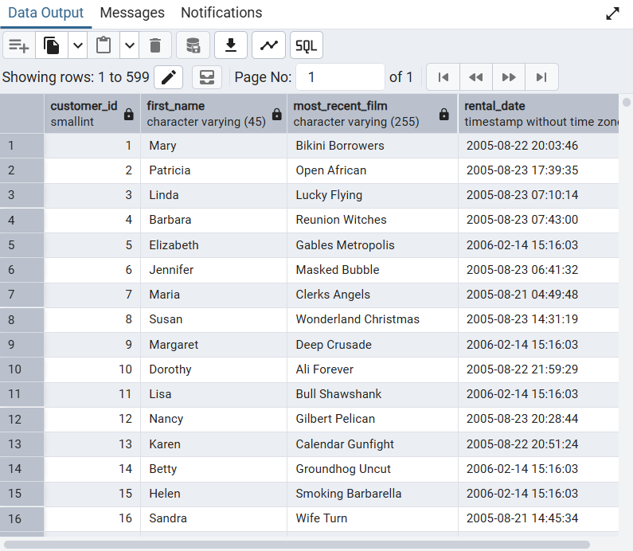

**Q11: Month-over-month revenue growth**
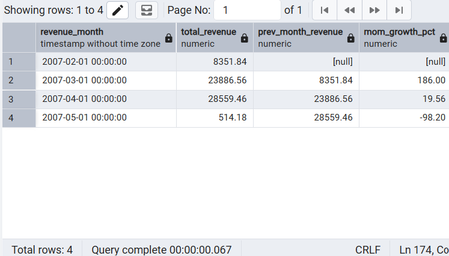

**Q12: Top 3 highest grossing films per category**
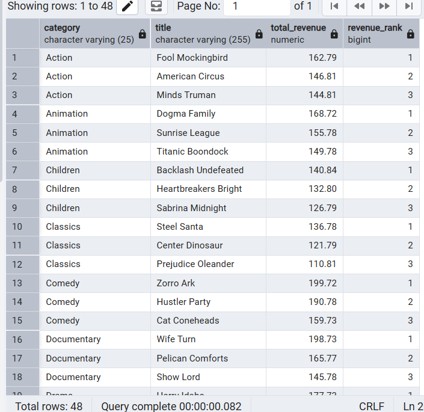

### Bonus Challenge

**Top staff member per store and revenue share**
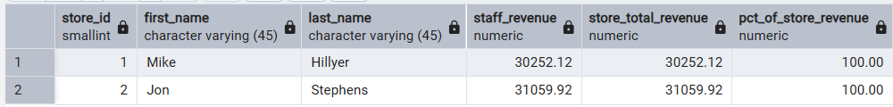

---

