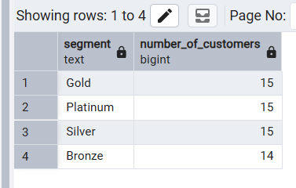
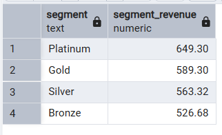
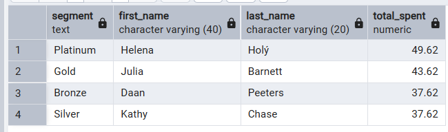
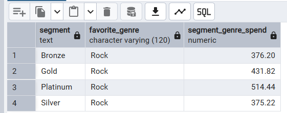
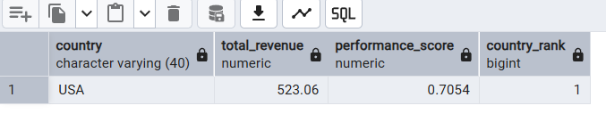
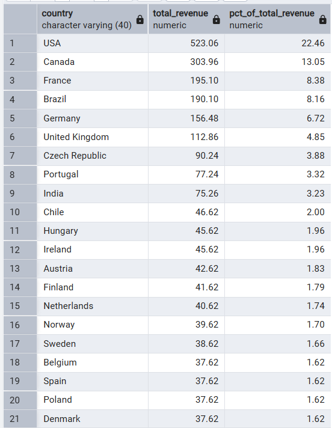
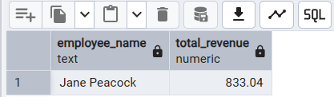
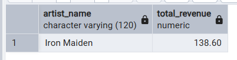
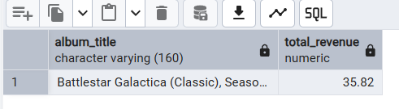

# Music Store Business Intelligence Pipeline

This is a step by step SQL pipeline built on the Music Store database.
Every stage is saved as a **view**, and later stages only read from those
views. Nothing is ever recalculated from the raw tables twice.

## How the pipeline is organized

| Stage | View name(s) | What it does |
|---|---|---|
| 1 | `customer_profile` | One row per customer: spend, invoices, tracks, genres, artists, months active |
| 2 | `customer_segments` | Adds a Platinum/Gold/Silver/Bronze label to every customer |
| 3 | `favorite_genres`, `customer_marketing` | Finds each customer's top genre and matches a campaign to their segment |
| 4 | `country_metrics`, `country_ranking` | Scores and ranks every country for expansion |
| 5 | (queries only, no new views) | The executive report, built purely from the views above |

To run it: open the database in pgAdmin, run `business_intelligence_pipeline.sql`
in full (this creates all the views), then run each numbered query under
"STAGE 5" one at a time and screenshot the result.

## Query outputs

Screenshots of each Stage 5 query, from `query_outputs/`.

| # | Query | Result |
|---|---|---|
| 5.1 | Customer Segment Summary |  |
| 5.2 | Revenue by Segment |  |
| 5.3 | Top Customer per Segment |  |
| 5.4 | Top Genre per Segment |  |
| 5.5 | Best Performing Country |  |
| 5.6 | Revenue Contribution by Country |  |
| 5.7 | Top Employee by Revenue |  |
| 5.8 | Top Artist by Revenue |  |
| 5.9 | Top Album by Revenue |  |

*(If your image files use underscores instead, e.g. `5_1.png`, just update the paths above to match.)*

## Segmentation logic (Task 2)

We did not segment customers on spending alone. A customer who spent a lot
in one single big order is not the same as a loyal, engaged customer. So the
segment is decided by three things together:

1. **total_spent** — how much money the customer brings in
2. **total_invoices** — how often they come back (loyalty)
3. **unique_genres** — how much of the catalog they explore (engagement)

Segmentation is done with **percentiles, not fixed numbers**. A rule like
"spend >= 30" only makes sense for one specific dataset size. On a large,
real dataset it could put almost every customer into Platinum, or almost
none, depending on how spending is actually distributed. Percentiles remove
that guesswork and automatically adjust to whatever data is loaded.

How it works:

1. `PERCENT_RANK()` compares every customer only against the other
   customers in the table, and returns a value from 0 (lowest) to 1
   (highest), separately for spend, invoice count, and genre count.
2. Those three percentile ranks are blended into one **composite score**,
   weighted by importance: spend 50%, loyalty (invoices) 30%, genre
   exploration (engagement) 20%.
3. `NTILE(4)` splits all customers into four **equal sized** groups based on
   that composite score. The top quarter becomes Platinum, next quarter
   Gold, then Silver, then Bronze.

Because this is quartile based, the segments stay evenly sized (roughly 25%
each) no matter if the table has 20 customers or 2 million, and the
cut-off points move automatically as the business grows, instead of a
number that has to be manually re-tuned every time the data changes.

## Marketing recommendation strategy (Task 3)

Each customer's favorite genre is found using `ROW_NUMBER()`, ranking the
genres they spent the most money on, and keeping only rank 1. `ROW_NUMBER()`
was chosen over `RANK()` here because we want exactly **one** favorite
genre per customer, even if two genres are tied in spend.

The campaign itself is decided by segment, matching the brief:

| Segment | Campaign | Why |
|---|---|---|
| Platinum | Early access to new releases | Reward loyalty, keep them exclusive |
| Gold | Album bundles | Encourage bigger single purchases |
| Silver | Genre discounts | Nudge them to buy more from a genre they already like |
| Bronze | First purchase coupon | Get low-engagement customers to buy again |

## Country ranking methodology (Task 4)

We score each country on five metrics: total revenue, average revenue per
customer, average invoice value, number of genres purchased, and number of
customers. Because these metrics use very different units (dollars vs.
counts), each metric is first **normalized** to a 0–1 scale using
min-max normalization: `(value - min) / (max - min)`. Only after
normalizing do we apply weights, otherwise revenue (measured in large
dollar amounts) would automatically dominate the score no matter what
weight we assigned it.

Weights used:

- Total revenue: **35%** — the main driver of expansion decisions
- Avg revenue per customer: **25%** — rewards high-value markets, not just big ones
- Avg invoice value: **15%** — how large a typical order is
- Genres purchased: **15%** — how broad local taste is (catalog fit)
- Customer count: **10%** — smallest weight, since a market can be small but still high-value

`RANK()` (not `ROW_NUMBER()`) is used for the final ranking so that if two
countries genuinely tie on score, they share the same rank.

## Actionable recommendations

These are grounded in the actual Stage 5 outputs above, not general advice.

1. **The segment split is genuinely even (15/15/15/14 across Platinum, Gold,
   Silver, Bronze — see 5.1)**, which confirms the percentile-based
   segmentation is working as designed on the real dataset, not just the
   sample. No need to re-tune thresholds.
2. **Segment revenue is closer together than the tier names suggest**
   (Platinum $649.30 vs Bronze $526.68, see 5.2), only about a 23% gap.
   Bronze and Silver customers ($526.68 and $563.32) are not a small
   afterthought, they're nearly as valuable in aggregate as Platinum. Don't
   under-invest in re-engaging them just because of the tier label.
3. **Rock is the top genre in every single segment** (5.4: Bronze $376.20,
   Gold $431.82, Platinum $514.44, Silver $375.22). This means the genre
   discount / bundle campaigns for Silver and Gold should be built around
   Rock inventory first, since that's where actual proven demand already
   sits, rather than spreading catalog investment evenly across genres.
4. **The top three countries for expansion are USA ($523.06, 22.46% of
   revenue), Canada ($303.96, 13.05%), and France ($195.10, 8.38%)** — see
   5.6. Together these three already account for about 44% of total
   revenue, so they're the clear priority for the localized catalog and
   marketing push the assignment asks about. Brazil ($190.10, 8.16%) is
   close behind France and worth watching as a fourth candidate.
5. **Revenue drops off sharply after the top group**: everything from
   Chile (rank 10, 2.00%) downward is under 2% of total revenue each
   (5.6). Expansion budget should follow that concentration, weighted
   heavily toward the top 3-4 countries rather than spread evenly across
   all 24+.
6. **Jane Peacock drives the most revenue among sales reps** ($833.04, 5.7).
   Worth understanding what she's doing differently (assigned accounts,
   follow-up cadence, etc.) and seeing if it can be repeated across the
   team.
7. **Iron Maiden ($138.60, 5.8) and the Battlestar Galactica (Classic)
   album ($35.82, 5.9) are the top revenue drivers by artist and album.**
   These are strong candidates for featured placement, bundling, or
   negotiating better licensing terms given their proven demand.

## Challenges faced and how they were solved

- **Different units when scoring countries**: raw revenue, averages, and
  counts cannot be added together fairly. Solved by normalizing every
  metric to 0–1 before applying weights.
- **Ties when picking a "favorite" genre or "top" customer**: solved with
  `ROW_NUMBER()`, which always produces exactly one winner even on a tie,
  which is what "the favorite genre" or "the top customer" requires.
- **Avoiding repeated calculations across Task 5**: solved by saving every
  earlier stage as a view instead of a one-off CTE, so the executive report
  queries only ever `SELECT` from those views.
- **Divide-by-zero risk** (e.g. a country with zero customers, or a
  customer with zero invoices when computing an average): solved with
  `NULLIF(denominator, 0)` everywhere a division happens.
