# Enterprise Analytics Layer: Customer Store Analytics Pipeline

A reusable SQL analytics layer built on top of the AdventureWorks OLTP schema (loaded into `customerstore_db`), feeding an executive dashboard notebook. The pipeline transforms raw operational tables into a layered set of views and materialized KPI tables, with nothing downstream of Stage 1 ever querying raw tables directly.

---

## 1. Database Overview

**Database:** `customerstore_db` (PostgreSQL 18)
**Source dataset:** AdventureWorks OLTP sample data, loaded via `install.sql`

### Raw schemas

| Schema | Contents |
|---|---|
| `sales` | Customers, stores, sales orders, order details, salespeople, territories |
| `production` | Products, categories, subcategories, inventory, locations |
| `humanresources` | Employees, departments, department history |
| `purchasing` | Vendors, purchase orders, purchase order details |
| `person` | Person records (names) linked to customers and employees |

The install script also creates shorthand convenience view schemas (`hr`, `pe`, `pr`, `pu`, `sa`) pointing at the same underlying data. These were not used in this project, all analytics reference the full schema names for readability.

### Notes on the raw data

During load, three computed columns from the original SQL Server design were dropped since they don't translate directly to Postgres:

- `sales.salesorderdetail.linetotal`
- `sales.customer.accountnumber`
- `sales.salesorderheader.salesordernumber`

`linetotal` is recalculated in this pipeline using the original formula:

```
line_revenue = ROUND(unitprice * (1 - unitpricediscount) * orderqty, 2)
```

### Dataset scale

> Run the query below in your Query Tool and paste the result here.

```sql
SELECT
    (SELECT COUNT(*) FROM sales.customer)             AS customers,
    (SELECT COUNT(*) FROM sales.salesorderheader)      AS sales_orders,
    (SELECT COUNT(*) FROM sales.salesorderdetail)      AS sales_order_lines,
    (SELECT COUNT(*) FROM production.product)          AS products,
    (SELECT COUNT(*) FROM purchasing.vendor)            AS vendors,
    (SELECT COUNT(*) FROM purchasing.purchaseorderheader) AS purchase_orders,
    (SELECT COUNT(*) FROM humanresources.employee)      AS employees;
```

**Result:**

| customers | sales_orders | sales_order_lines | products | vendors | purchase_orders | employees |
|---|---|---|---|---|---|---|
| 19,820 | 31,465 | 121,317 | 504 | 104 | 4,012 | 290 |

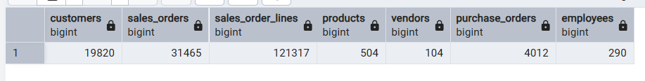

Note the 19,820 total customer records is slightly higher than the 19,119 "active purchasing customers" figure used throughout the dashboard observations, the difference (701 customers) represents customer records with zero completed orders, they are excluded from revenue, repeat rate, and segmentation calculations since those are all scoped to customers with `total_orders > 0`.

### Date range covered

> Run this and paste the result here.

```sql
SELECT MIN(orderdate) AS earliest_order, MAX(orderdate) AS latest_order
FROM sales.salesorderheader;
```

**Result:**

| earliest_order | latest_order |
|---|---|
| 2022-05-30 | 2025-06-29 |

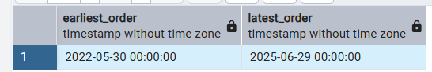

> **Important finding:** the data covers roughly three years and one month, ending mid 2025. This means 2025 in the dataset is only a partial year (about 6 months) compared against 2024, which is a full 12 months. This directly explains the uniform negative year-over-year growth seen across every single territory in the Territory Rankings chart (Section 10 of the notebook), and the sharp drop in the final points of the monthly revenue and purchasing trend charts. These are not real declines, they are a partial-year-vs-full-year comparison artifact. Any year-over-year or "latest year" figures in the dashboard should be footnoted accordingly, or 2025 should be excluded from year-over-year comparisons entirely until the year is complete.

### Database size

```sql
SELECT pg_size_pretty(pg_database_size('customerstore_db')) AS database_size;
```

**Result:**

| database_size |
|---|
| 100 MB |

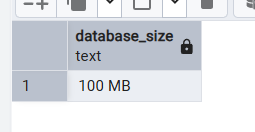

---

## 2. Analytics Architecture

The pipeline is organized into four layered stages, each one building only on the stage before it. No stage after Stage 1 ever queries a raw schema directly, this was a deliberate design constraint so that a single source of truth exists for any given calculation (for example, `line_revenue` is calculated exactly once, in `sales_line_analytics`, and every later view or table reuses that column instead of recalculating it).

```
Raw Tables (sales, production, humanresources, purchasing, person)
        |
        v
STAGE 1: Base Analytics Views        (10 objects, 7 business domains)
        |
        v
STAGE 2: Business Metrics             (6 views: revenue trends, product/category
        |                              performance, RFM base, salesperson ranking)
        v
STAGE 3: Segmentation & Regional      (5 views: customer segments, LTV, repeat
        |                              customers, retention, regional performance)
        v
STAGE 4: Executive KPI Tables         (7 materialized tables, dashboard-ready)
        |
        v
Jupyter Notebook (executive_analysis.ipynb)
   reads ONLY from Stage 3 and Stage 4 outputs
```

### Why views for Stages 1 to 3, but tables for Stage 4

Stages 1 through 3 are `CREATE OR REPLACE VIEW`, they always reflect live data and cost nothing until queried, which matters while the pipeline is still being iterated on.

Stage 4 is `CREATE TABLE ... AS`, a materialized snapshot. Executive dashboards should query pre-computed numbers instantly rather than re-running expensive joins and window functions on every notebook refresh. The tradeoff is that Stage 4 tables need to be manually refreshed (dropped and recreated) if the underlying data changes, this is an explicit assumption, see Section 6.

---

## 3. Intermediate Tables and Views Created

All objects live in a dedicated `analytics` schema, kept separate from the raw operational schemas.

### Stage 1: Base Analytics Views (10 objects)

| # | Object | Domain | Grain |
|---|---|---|---|
| 1 | `customer_analytics` | Customer | One row per customer |
| 2 | `product_analytics` | Product | One row per product |
| 3 | `sales_line_analytics` | Sales | One row per order line (foundation view) |
| 4 | `employee_analytics` | Employee | One row per employee |
| 5 | `salesperson_analytics` | Employee/Sales | One row per salesperson |
| 6 | `territory_analytics` | Territory | One row per territory |
| 7 | `inventory_analytics` | Inventory | One row per product/location |
| 8 | `vendor_analytics` | Vendor | One row per vendor |
| 9 | `purchase_line_analytics` | Purchasing | One row per PO line |
| 10 | `date_dim` | Date | One row per calendar day (materialized table) |

### Stage 2: Business Metrics (6 views)

| # | Object | Purpose |
|---|---|---|
| 11 | `monthly_revenue` | Monthly revenue, profit, order count, MoM growth via `LAG()` |
| 12 | `quarterly_revenue` | Same pattern one grain up, QoQ growth |
| 13 | `product_performance` | Revenue/profit ranking per product via `RANK()` |
| 14 | `category_performance` | Category rollup, high vs low margin split (40% threshold) |
| 15 | `customer_rfm` | Raw recency, frequency, monetary base metrics |
| 16 | `salesperson_ranking` | Revenue rank plus quota attainment status |

### Stage 3: Segmentation and Regional Analysis (5 views)

| # | Object | Purpose |
|---|---|---|
| 17 | `customer_segments` | RFM quartile segmentation via `NTILE(4)` into 6 labeled segments |
| 18 | `customer_ltv` | Tenure-based annualized customer value, chained CTEs |
| 19 | `repeat_customers` | One-time vs repeat buyer counts and repeat rate |
| 20 | `customer_retention` | Year-over-year retention using a self-referencing CTE |
| 21 | `regional_performance` | Territory revenue, YoY growth, yearly rank |

### Stage 4: Executive KPI Tables (7 materialized tables)

| # | Object | Purpose |
|---|---|---|
| 22 | `kpi_top_bottom_products` | Top 10 and bottom 10 products by revenue |
| 23 | `kpi_employee_performance` | Revenue contribution % and vs-team-average comparison |
| 24 | `kpi_territory_rankings` | Latest year territory ranks with performance tier |
| 25 | `kpi_inventory_health` | Per-product stock status rolled up across locations |
| 26 | `kpi_supplier_performance` | Vendor quality rank and speed rank, spend |
| 27 | `kpi_purchasing_trends` | Monthly purchasing spend and MoM growth |
| 28 | `kpi_executive_summary` | Single-row top-line summary (built last, depends on 26 and 25) |

**Total: 28 analytics objects** (20 views, 8 materialized tables) across 4 stages.

### Verifying the full object count

```sql
SELECT
    (SELECT COUNT(*) FROM information_schema.views WHERE table_schema = 'analytics') AS view_count,
    (SELECT COUNT(*) FROM information_schema.tables
       WHERE table_schema = 'analytics' AND table_type = 'BASE TABLE') AS table_count;
```

**Result:**

| view_count | table_count |
|---|---|
| 20 | 8 |

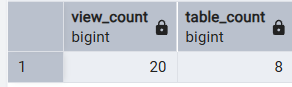

This confirms the object count: 20 views (Stages 1 to 3, minus `date_dim` which is a table) plus 8 materialized tables (`date_dim` from Stage 1 and the 7 Stage 4 KPI tables), 28 objects total in the `analytics` schema, matching the breakdown in Section 3.

---

## 4. SQL Design Decisions

**Layered dependency, never re-touch raw tables after Stage 1.**
Every Stage 2, 3, and 4 object is built exclusively on Stage 1 (or earlier Stage 2/3) objects. This means a bug fix or refinement made once (for example, the `line_revenue` calculation) automatically propagates to every view and table downstream without needing to be repeated.

**`line_revenue` calculated once, reused everywhere.**
Since `linetotal` was dropped from `sales.salesorderdetail` during load, it is recalculated exactly once in `sales_line_analytics` and never recalculated again anywhere else in the pipeline.

**Views for Stages 1 to 3, materialized tables for Stage 4.**
Explained in Section 2. Views stay current automatically; Stage 4 tables trade that freshness for query speed on the dashboard side.

**Window functions over self-joins.**
`LAG()` is used for month-over-month and quarter-over-quarter growth (`monthly_revenue`, `quarterly_revenue`, `regional_performance`) instead of a self-join, avoiding a second pass over the same data. `RANK()` is used for product, salesperson, and territory ranking rather than a correlated subquery per row.

**`NTILE(4)` for RFM segmentation rather than fixed cutoffs.**
Customer segments are built from quartiles of the actual customer base rather than hardcoded revenue thresholds, so the segmentation adapts automatically if the customer base grows or shifts, instead of using cutoff values tuned to today's data.

**Conditional aggregation instead of separate queries.**
`repeat_customers` uses `COUNT(*) FILTER (WHERE ...)` to compute one-time vs repeat counts and the repeat rate in a single pass, rather than three separate queries unioned together.

**Two independent supplier rankings instead of one blended score.**
`kpi_supplier_performance` ranks vendors separately on quality (`quality_rank`, by reject rate) and speed (`speed_rank`, by lead time) rather than combining them into a single score. A vendor that is fast but unreliable and a vendor that is slow but flawless would otherwise be indistinguishable under a blended metric, which would hide a real tradeoff from a purchasing decision.

**Excluding cancelled orders.**
`sales_line_analytics` filters out `soh.status <> 6` (Cancelled), so every downstream revenue and profit figure reflects orders that were actually fulfilled, not orders that were placed and later cancelled.

**`kpi_executive_summary` built last, on purpose.**
It depends on `kpi_purchasing_trends` and `kpi_inventory_health` already existing, so it is deliberately the final statement in the Stage 4 script rather than being built independently.

---

## 5. Challenges Faced

**Corrupted CSVs using non-standard delimiters (the hardest issue in this project).**
13 of the 68 source CSVs turned out to be corrupted inside the zip, they used a literal `+|` as the field separator and `&|` as a row-end marker instead of real tabs and newlines. This caused `install.sql`'s `\copy` command to silently fail on exactly those 13 tables, leaving them empty in the database with no visible error, while every other table (Product, Customer, SalesOrder and so on) loaded correctly. This was diagnosed by reconciling which tables actually held data against which were unexpectedly empty, then inspecting the raw CSV bytes to find the non-standard separators.

Rather than fixing all 13 blindly, each one was checked against the analytics pipeline's actual dependencies first. Only 3 of the 13 corrupted tables were touched by any view or table in this project, `Person`, `Store`, and `BusinessEntity`, since these feed directly into `customer_analytics` (customer names, individual vs store type) and other Stage 1 views. The other 10 corrupted tables (`Password`, `EmailAddress`, `PhoneNumberType`, `JobCandidate`, and others) are never referenced anywhere in the analytics schema, so they were deliberately left broken rather than spending time repairing data that would never be queried. Two of those 10, `JobCandidate.csv` and `ProductModel.csv`, also contained embedded multi-line XML fields that would have made a clean fix considerably harder, reinforcing the decision to skip them since neither is used in the pipeline.

**Fix applied:**
1. Rebuilt the 3 needed CSVs (`Person.csv`, `Store.csv`, `BusinessEntity.csv`) with correct tab and newline delimiters, packaged as `fixed_csvs.zip`.
2. Wrote a dedicated `reload_fixed_tables.sql` script to truncate and reload only those 3 tables, rather than re-running the full `install.sql` load.
3. Placed the 3 fixed CSVs directly into the `week3_hackathon_dataset` folder, overwriting the originally broken files, alongside `reload_fixed_tables.sql`.
4. From Command Prompt, `cd` into that folder and ran:
   ```
   "C:\Program Files\PostgreSQL\18\bin\psql.exe" -U postgres -d customerstore_db -f reload_fixed_tables.sql
   ```

This prioritization, fixing only what the pipeline actually depends on, avoided a substantial amount of unnecessary cleanup work on tables like `Password` and `EmailAddress` that have no bearing on the analytics layer.

**Dropped computed columns not translating from SQL Server to Postgres.**
`sales.salesorderdetail.linetotal` (along with `accountnumber` on `sales.customer` and `salesordernumber` on `sales.salesorderheader`) does not exist after load, since these were SQL Server computed columns and don't carry over automatically to Postgres. This surfaced as a "column does not exist" error at `sales_line_analytics`, the very first view in the pipeline that needed `linetotal`, and required tracing every column reference in the pipeline against the actual `install.sql` DROP COLUMN statements before proceeding, rather than assuming the schema matched the original AdventureWorks documentation exactly. `linetotal` was recalculated once, using the original formula (`unitprice * (1 - unitpricediscount) * orderqty`), directly inside `sales_line_analytics`, so every downstream view and table reuses that single recalculated column instead of repeating the calculation.

---

## 6. Assumptions Made

- All monetary figures are treated as a single currency (USD) with no multi-currency conversion, consistent with how the AdventureWorks sample data is structured.
- The 40 percent profit margin threshold used to split "high margin" from "low margin" revenue in `category_performance` is a chosen business rule for this analysis, not a value present in the source data.
- Customer segmentation labels (Champions, Loyal Customers, At Risk, Lost, and so on) follow a standard RFM (recency, frequency, monetary) framework interpretation, not a client-specified rulebook.
- `safetystocklevel` and `reorderpoint` values in `production.product` are assumed to reflect intentional, currently valid business thresholds rather than stale placeholder values, even where those thresholds produce a high reorder rate for a given category (see the Bikes category, where a narrow 25-unit gap between reorder point and safety stock level results in a high proportion of reorder flags across two manufacturing locations per product).
- Stage 4 tables are point-in-time snapshots and are assumed to be manually refreshed (via re-running the Stage 4 script) after any meaningful change to the underlying order, inventory, or purchasing data. There is no scheduled refresh job in this project.
- Cancelled orders (`status = 6`) are assumed to represent orders that should be fully excluded from revenue and profit reporting, not partially counted or flagged separately.
- **Confirmed, not just assumed:** the dataset's order history runs from May 30, 2022 through June 29, 2025, meaning 2025 is only a partial year (about 6 months) rather than a full 12 months. This explains the uniform negative year-over-year growth seen across every single territory in the Territory Rankings chart, and the sharp drop in the final points of the monthly revenue and purchasing trend charts. These are a partial-year-vs-full-year comparison artifact, not a real business decline, and should be footnoted or excluded from year-over-year reporting until 2025 is a complete year in the source data.
- `productsubcategoryid IS NULL` products (which resolve to a null `category_name`) are assumed to represent raw materials and manufacturing components consumed internally rather than sellable finished goods, based on their high count and their absence from any retail category hierarchy.

---

## 7. Project Structure

```
enterprise_analytics_hackathon/
│
├── README.md                   This file
│
├── analytics_pipeline.sql      Full Stage 1-4 SQL pipeline
│
├── executive_analysis.ipynb    Jupyter notebook, reads only from Stage 3/4 outputs
│
├── Screenshots/                pgAdmin schema tree, query results, verification outputs
│
├── charts/                     Exported chart images from the notebook
│
└── documentation/              Supporting notes, task write-ups, executive recommendations
```

---

## 9. Sample Query Outputs

Beyond the pipeline objects themselves, these queries were run against the finished pipeline to pull out specific business answers. Each one is included because it surfaces something with actual analytical value, not just a row count or a structural check.

### Monthly revenue trend

```sql
SELECT * FROM analytics.monthly_revenue;
```

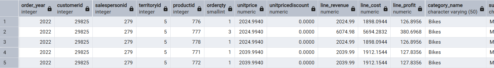

### Top 10 products by revenue

```sql
SELECT * FROM analytics.product_performance ORDER BY revenue_rank LIMIT 10;
```

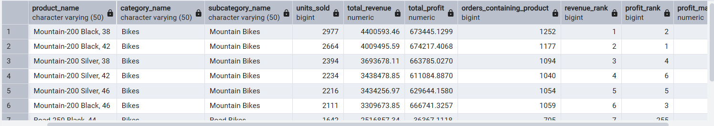

### Sales team quota attainment distribution

```sql
SELECT quota_status, COUNT(*) FROM analytics.salesperson_ranking GROUP BY quota_status;
```

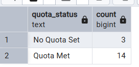

### Top salesperson

```sql
SELECT * FROM analytics.salesperson_ranking WHERE revenue_rank = 1;
```

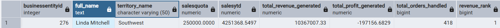

### Customer segment distribution (RFM)

```sql
SELECT segment, COUNT(*) FROM analytics.customer_segments GROUP BY segment;
```

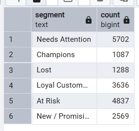

### Repeat customer rate

```sql
SELECT * FROM analytics.repeat_customers;
```

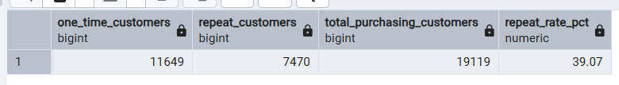

### Regional performance, 2023 (a full, non-partial year)

```sql
SELECT * FROM analytics.regional_performance WHERE order_year = 2023;
```

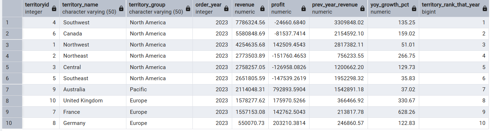

### Inventory health by category

```sql
SELECT category_name, overall_stock_status, COUNT(*)
FROM analytics.kpi_inventory_health
GROUP BY category_name, overall_stock_status
ORDER BY category_name, overall_stock_status;
```

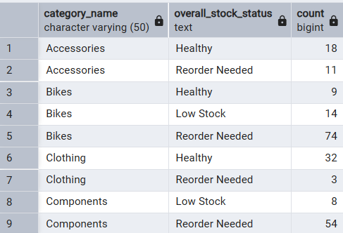

### Bikes inventory detail

Directly backs the Bikes reorder-rate assumption in Section 6.

```sql
SELECT product_name, quantity_on_hand, safetystocklevel, reorderpoint, stock_status
FROM analytics.inventory_analytics
WHERE category_name = 'Bikes'
ORDER BY product_name
LIMIT 15;
```

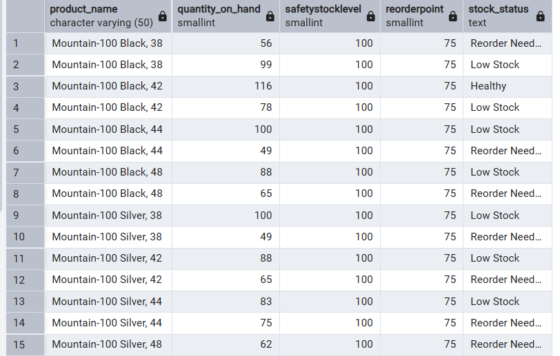

---

## 10. How to Reproduce This Project

1. Load the dataset: run `install.sql` against a fresh Postgres database.
2. Run `analytics_pipeline.sql` in full (Stages 1 through 4) via pgAdmin's Query Tool or `psql`.
3. Open `executive_analysis.ipynb`, fill in your database connection details in the setup cell, and run all cells top to bottom.
4. Export the notebook to PDF or HTML for sharing, and save individual chart images into `charts/` if needed separately.
