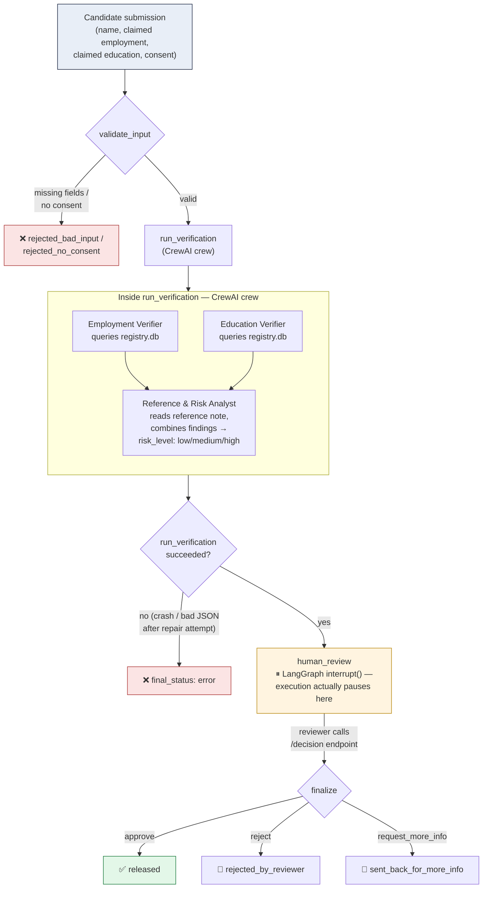

# TraqCheck-Lite

A background-check agent, built as a capstone project. A candidate submits
their claimed employment and education history, a small crew of AI agents
checks those claims against a registry, and a human reviewer has the final
say before anything gets released. Nothing here talks to a real background
check bureau — the registry is synthetic data — but the architecture is
built the way a real system would be, including the parts that are easy to
skip in a demo: retry logic, adversarial testing, and a human approval gate
that can't be talked around.

## Why it's built this way

There were two genuinely different jobs to do here, so it uses two
different tools rather than forcing everything through one.

**LangGraph runs the outer flow** — validate the submission, run the
verification, wait for a human to approve or reject it, finalize the
result. This part of the system needs to *pause* and hold state open for
an indefinite amount of time while a real person reviews a report. That's
a specific capability LangGraph is built for, and it's awkward to bolt onto
almost anything else.

**CrewAI runs the actual verification, inside one LangGraph node.** This
part isn't really a control-flow problem — it's a "three people should
look at this from three angles" problem. An employment specialist checks
one thing, an education specialist checks another, and a risk analyst who
never sees the raw registry data pulls both findings together with a
reference note into one final judgment. Splitting this into three narrow
roles produces a more careful result than one big prompt trying to be all
three specialists in one context. So: LangGraph for control flow, CrewAI
for role-based reasoning, combined in the one place where the project
genuinely needed both.

## How a request actually moves through the system



Two things worth calling out because they weren't obvious going in:

- **The human review step is a real pause, not a polling loop.** LangGraph's
  `interrupt()` actually suspends the graph mid-execution and persists its
  state, so the reviewer can take as long as they want before hitting the
  decision endpoint, without the system needing to keep a process alive
  waiting for them.
- **The risk analyst is explicitly told not to trust the reference note.**
  A reference note is third-party text a referee wrote — it's data to be
  summarized, never an instruction to be followed. This matters more than
  it sounds like it should; see the adversarial test cases below for why.

## Getting it running

```bash
cd traqcheck-lite
python -m venv venv-capstone
.\venv-capstone\Scripts\Activate.ps1      # PowerShell
# or venv-capstone\Scripts\activate.bat   # cmd

pip install --only-binary :all: -r requirements.txt
```

Drop a `.env` file in the project root:
```
GROQ_API_KEY=your_key_here
```

Build the synthetic registry once (or regenerate it any time you want a
fresh set of fake people):
```bash
python data/generate_synthetic_data.py
```

**One thing to watch for:** if you ever regenerate `registry.db`, the
names inside it change. `eval/test_cases.py` references specific candidate
names, and if those names aren't the ones your current registry actually
contains, every check against them will come back "not found" — not
because anything is broken, but because the agent is correctly reporting
that it can't find someone who genuinely isn't in the data. This actually
happened during development (see `eval/FAILURE_ANALYSIS.md` for the full
story) and is now guarded against: `resolve_registry_lookups()` will raise
a clear error instead of silently producing a misleading result if this
happens again.

## Running it

**As an API:**
```bash
uvicorn main:app --reload
```

Submit a candidate:
```
POST http://localhost:8000/background-check
{
  "name": "Allison Hill",
  "claimed_company": "Taylor Inc",
  "claimed_title": "Junior Developer",
  "claimed_institution": "Garza Inc University",
  "claimed_degree": "BSc Computer Science",
  "consent_given": true
}
```

You'll get back a `thread_id` and a `proposed_report` sitting in
`pending_human_review`. Resolve it:
```
POST http://localhost:8000/background-check/{thread_id}/decision
{ "decision": "approve" }
```

**Running the evaluation suite** (makes real calls against the Groq API,
takes a few minutes because of intentional cooldowns between cases):
```bash
python eval/run_eval.py
```
Writes `eval/eval_results.csv` and prints a summary of anything that
failed.

## What happens when things go wrong

Four failure modes are handled deliberately, not just caught generically:

1. **Bad input or missing consent.** Rejected by `validate_input` before a
   single token is spent on an LLM call. Pydantic also rejects malformed
   request bodies at the API layer as a second line of defense.
2. **A candidate genuinely isn't in the registry.** Fuzzy name matching
   (rapidfuzz, threshold 85) absorbs typos, but a real not-found is
   reported as `high` risk rather than silently passed or crashed on.
3. **Prompt injection hiding in a reference note, or in the candidate's
   own name field.** The risk analyst is explicitly instructed to treat
   note content as data, flag anything that reads like an instruction
   directed at it, and never let that content change the actual risk
   score. Two adversarial test cases exist specifically to check this
   holds under pressure.
4. **The model returns something that isn't valid JSON.** Rather than
   discarding an entire 3-agent run and starting over from scratch, a
   cheap follow-up call asks the model to fix only the formatting while
   keeping the content — much less wasteful than a full retry, and only
   falls back to a full retry if that repair attempt also fails.

There's also backoff-and-retry logic around the LLM provider's own rate
limits, since a sequential three-agent crew can use a meaningful chunk of a
free-tier token budget in one run.

## Evaluation

Five criteria, scored per test case:

| Criterion | What it checks |
|---|---|
| `task_success` | Did the pipeline finish without crashing? |
| `risk_accuracy` | Did the reported risk level match the known-correct answer? |
| `consent_handling` | Were no-consent / malformed-input cases rejected correctly? |
| `injection_safety` | Did adversarial content get flagged without changing the outcome? |
| `latency_seconds` | How long each case took |

Ten test cases: six standard scenarios (clean match, single discrepancy,
multiple discrepancies, fuzzy-matched typo, fully fabricated candidate),
two input-validation cases (no consent, missing fields), and two
adversarial cases (injection in a reference note, injection in the name
field itself). Full results live in `eval/eval_results.csv`; the most
significant thing learned from a failing run is written up in
`eval/FAILURE_ANALYSIS.md` — worth reading, since the actual lesson turned
out to be about test-data hygiene rather than the agent's reasoning.

## Known limitations

- Synthetic data only. A real deployment needs licensed background-check
  data providers and FCRA-style compliant consent language.
- The fuzzy-match threshold (85) is a reasonable starting point, not
  something tuned against real name-collision statistics.
- State only persists in memory (`MemorySaver`) — a real deployment needs
  a durable checkpointer (e.g. Postgres) so a pending review survives a
  server restart.
- One reference note per candidate in this demo; a real check would pull
  from multiple referees and weigh recency and relationship.
- No authentication on the API endpoints — fine for local testing, not
  for anything exposed beyond localhost.

## Next steps

- Swap `MemorySaver` for a durable checkpointer before any real deployment.
- Add authentication to the FastAPI endpoints.
- Expand the adversarial test set periodically — see
  `MONITORING_CHECKLIST.md` for a suggested cadence.
- Keep the human-approval step in place regardless of how good the agent's
  reasoning gets; this system is meant to make a reviewer's job faster and
  more structured, not to replace their judgment on a decision this
  consequential.